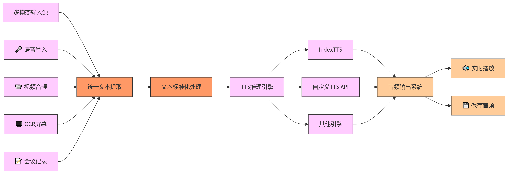

# STS_Tools
## 运行效果图：
  
*STS_Tools工具界面*

## 📖 项目概述
**STS_Tools** 是一个正在开发中的多功能语音处理工具。


## 🌐 系统架构

### 核心流程图


### 架构说明
| **模块**         | **功能说明**                                                                 |
|------------------|----------------------------------------------------------------------------|
| **多模态输入源**  | 支持语音、视频、OCR等多种输入方式                                           |
| **文本标准化处理** | 清理/格式化文本，统一编码                                                   |
| **TTS推理引擎池** | 可插拔架构，当前支持：<br>- IndexTTS（默认）<br>- 自定义API<br>- 其他兼容引擎 |
| **音频输出系统**  | 统一接口处理所有TTS引擎的输出，支持：<br>- 实时播放<br>- WAV/MP3文件保存      |

- **用途**:
  - 语音转录与转换
  - 会议记录自动化
  - 无障碍辅助工具开发

- **核心功能**:
  ✅ 已实现:
  - 语音转文本(STT)
  - 通过IndexTTS实现的文本转语音(TTS)
  
  🔜 规划中:
  - 屏幕OCR文字输入
  - 会议音频自动处理
  - 多TTS引擎支持

## 🚀 快速开始

### 环境要求
- Python 3.8+
- 音频输入设备
- 音频输出设备

### 安装步骤
```bash
git clone https://github.com/your-repo/STS_Tools.git
cd STS_Tools
pip install -r requirements.txt

### 运行流程
```bash
启动CapsWriter（可选）
启动indextts
python main.py
